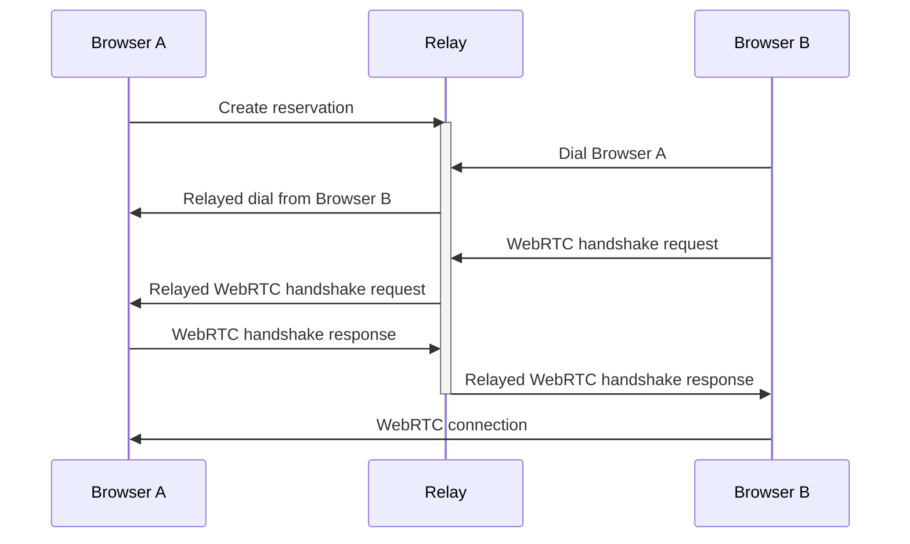

# @libp2p/example-browser-pubsub <!-- omit in toc -->

[](http://libp2p.io/)
[](https://discuss.libp2p.io)
[](https://codecov.io/gh/libp2p/js-libp2p-examples)
[](https://github.com/libp2p/js-libp2p-examples/actions/workflows/ci.yml?query=branch%3Amain)

> User libp2p pubsub in browsers

This example leverages the [vite bundler](https://vitejs.dev/) to compile and serve the libp2p code in the browser. You can use other bundlers such as Webpack, but we will not be covering them here.

## Table of contents <!-- omit in toc -->

- [Setup](#setup)
- [Running](#running)
  - [Why do I need a Relay Server?](#why-do-i-need-a-relay-server)
  - [Start the Relay Server](#start-the-relay-server)
  - [Running the Example](#running-the-example)
- [License](#license)
- [Contribution](#contribution)

## Setup

1. Install example dependencies
    ```console
    $ npm install
    ```
2. Open 2 terminal windows in the `./src` directory.

## Running

This example has three components.  Two browser windows which will send pubsub messages and a relay server that they will use to establish the initial connection.

### Why do I need a Relay Server?

The only transport available to browser nodes that lets them be dialed by remote peers is the [WebRTC](https://www.npmjs.com/package/@libp2p/webrtc) transport.

This transport requires an initial [handshake](https://en.wikipedia.org/wiki/Session_Description_Protocol) to be done out-of-band, during which the two peers exchange their capabilities, addresses and open ports.

We use a [Circuit Relay](https://docs.libp2p.io/concepts/nat/circuit-relay/) server to establish an initial communication channel between the two browsers for this process, after which they will have negotiated a peer-to-peer connection and the relay will no longer be used.



### Start the Relay Server

For browsers to communicate, we first need to run the libp2p relay server:

```console
$ npm run relay
```

Copy one of the multiaddresses in the output.

### Running the Example

Start the Vite server:

```console
$ npm start
```

A browser window will automatically open. Let's call this `Browser A`.

1. Paste the copied multiaddress from the relay server, paste it into the `Dial MultiAddr` input and click the `Connect` button
2. `Browser A` is now connected to the relay server
3. Copy the multiaddress located after the `Listening on` message

Now open a second browser with the url `http://localhost:5173/`. Let's call this `Browser B`.

1. Using the copied multiaddress from `Listening on` section in `Browser A`, paste it into the `Remote MultiAddress` input and click the `Connect` button
2. `Browser B` is now connected to `Browser A`

You can now shut down the relay server if you wish.

1. In both `Browser A` and `Browser B`, enter the same topic name in the "Subscribe to topic" input and click the "Subscribe" button
2. In either browser, enter a message in the `Send Message to Topic` field and click "Send"

You should see the message appear in the output section towards the bottom of the other browser window.

## License

Licensed under either of

- Apache 2.0, ([LICENSE-APACHE](LICENSE-APACHE) / <http://www.apache.org/licenses/LICENSE-2.0>)
- MIT ([LICENSE-MIT](LICENSE-MIT) / <http://opensource.org/licenses/MIT>)

## Contribution

Unless you explicitly state otherwise, any contribution intentionally submitted
for inclusion in the work by you, as defined in the Apache-2.0 license, shall be
dual licensed as above, without any additional terms or conditions.
